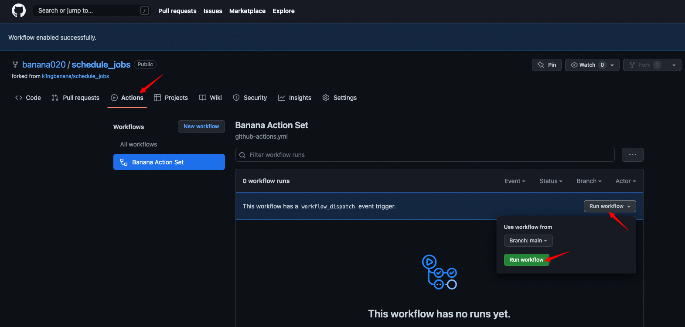
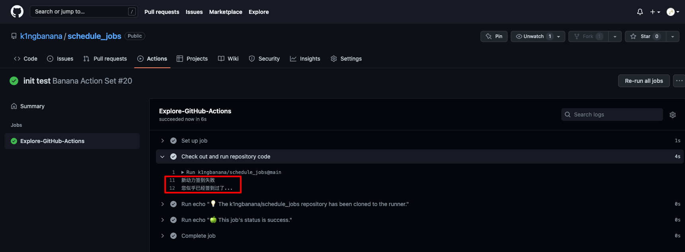
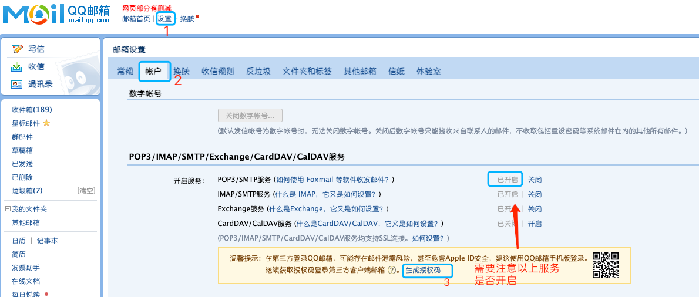

# schedule_jobs

> 每天新动力自动签到 时间自定义，默认 8:00 **注意，触发时间有可能延后几个小时。**

## 使用

### fork 我的项目

在项目 `settings => secrets` 添加 `XINDONGLI_URL`, `XINDONGLI_USERNAME`, `XINDONGLI_PASSWORD`
字段，设置好可以手动触发一次，验证是否正确，下次就会定时触发了。




如图所示有结果输出，就成功了。


#### 开启邮箱发送日志的服务

在项目 `settings => secrets` 中需要额外添加以下字段

|           字段名 | 含义                             | 默认值      |
| ---------------: | :------------------------------- | ----------- |
|      MAIL_SENDER | 发送方邮箱                       | -           |
|    SMTP_PASSWORD | 发送方 SMTP 服务的授权码或者口令 | -           |
| MAIL_HOST_SENDER | 发送邮件服务器                   | smtp.qq.com |
| MAIL_PORT_SENDER | 发送邮件服务器的端口号           | 465         |
|   MAIL_RECIPIENT | 邮件接受方                       | -           |

以 QQ 邮箱为例



|           字段名 | 举例                   |
| ---------------: | :--------------------- |
|      MAIL_SENDER | xxx@qq.com（自己邮箱） |
|    SMTP_PASSWORD | 上图获取的授权码       |
| MAIL_HOST_SENDER | smtp.qq.com            |
| MAIL_PORT_SENDER | 465                    |
|   MAIL_RECIPIENT | xxx@qq.com（自己邮箱） |

#### 开启企业微信提醒

在项目 `settings => secrets` 中需要额外添加以下字段

|         字段名 | 含义               | 默认值 |
| -------------: | :----------------- | ------ |
| WECHAT_BOT_URL | 机器人接受消息地址 | -      |


### 新建项目或者已有项目

添加 `.github/workflows/main.yml` 文件，其中 `main` 可以自定义成其他名称。

```yml
name: Banana Action Set
on:
  push:
  workflow_dispatch:
  schedule:
    # 定时任务 每天 8:00 自动签到，按照计划任务队列，可能延迟 0 + 8 = 北京时间 8
    - cron: "00 0 * * *"
jobs:
  Explore-GitHub-Actions:
    runs-on: ubuntu-latest
    steps:
      - name: Check out and run repository code
        uses: k1ngbanana/schedule_jobs@main
        env:
          XINDONGLI_URL: ${{secrets.XINDONGLI_URL}}
          XINDONGLI_USERNAME: ${{secrets.XINDONGLI_USERNAME}}
          XINDONGLI_PASSWORD: ${{secrets.XINDONGLI_PASSWORD}}
          MAIL_SENDER: ${{secrets.MAIL_SENDER}}
          SMTP_PASSWORD: ${{secrets.SMTP_PASSWORD}}
          MAIL_HOST_SENDER: ${{secrets.MAIL_HOST_SENDER}}
          MAIL_PORT_SENDER: ${{secrets.MAIL_PORT_SENDER}}
          MAIL_RECIPIENT: ${{secrets.MAIL_RECIPIENT}}
          WECHAT_BOT_URL: $${secrets.WECHAT_BOT_URL}}
      - run: echo "💡 The ${{ github.repository }} repository has been cloned to the runner."
      - run: echo "🍏 This job's status is ${{ job.status }}."
```

### 参考

[若川大大的掘金签到](https://github.com/lxchuan12/juejin-actions)
