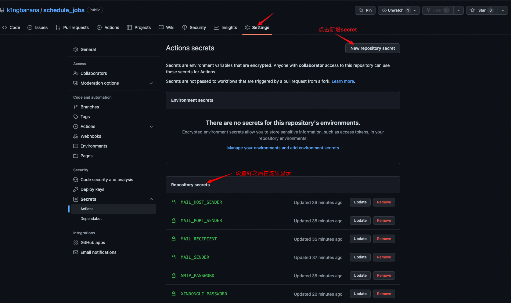

# schedule_jobs

> 每天新动力自动签到 时间自定义，默认8:00，实际响应时间要9点多（有延迟）

## 使用

### fork 我的项目
在项目 `settings => secrets` 添加 `XINDONGLI_URL`, `XINDONGLI_USERNAME`, `XINDONGLI_PASSWORD` 
字段，设置好可以手动触发一次，验证是否正确，下次就会定时触发了。

